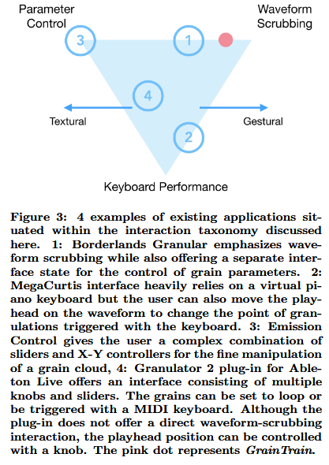
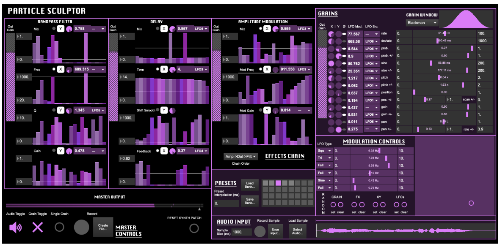
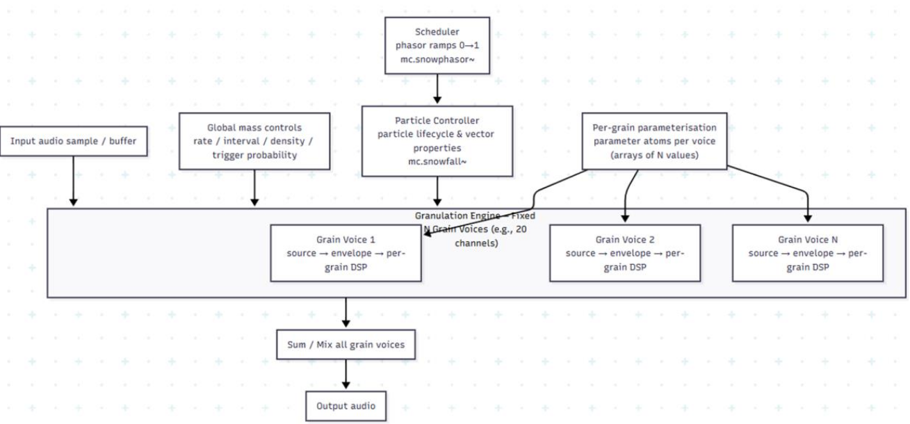
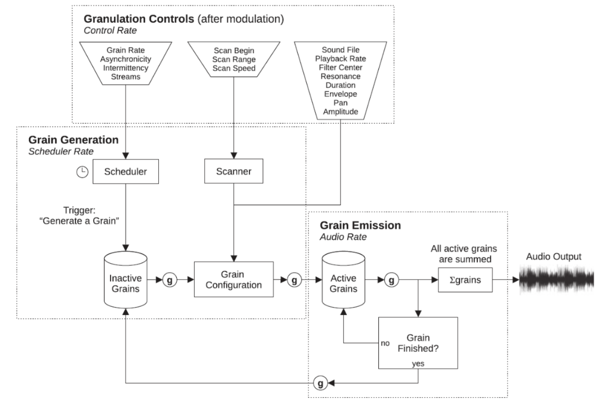

# CerberusGran: Multi-head granular synthesis

## Motivation 
Current granular synthesis tools are often limited to a single stream of audio, removing the opportunity to finely manipulate individual grains. Whilst multi-head synthesis is not a fundamental concept in granular synthesis, it greatly opens the door to more abstract timbral possibilities and creative use cases.  Granular synthesis broadly enables musicians to explore sound worlds not possible through other methods, but this requires a significant knowledge floor. In a real-time granular synthesizer, users are often required to manipulate numerous low-level parameters whose combined effects on timbre and texture are hard to predict.Granular synthesis' expressive potential often translates to great difficultly to navigate the parameter space as system complexity increases; As a result, increased technical flexibility does not always translate into intuitive control or coherent musical expression. Using physical gestures to control a granular synthesis like with [“GrainTrain"](https://anilcamci.github.io/publications/Camci_2018_NIME_GrainTrain.pdf) or the [“CrumbleBag”](https://www.nime.org/proceedings/2004/nime2004_074.pdf), helps lower the knowledge floor, permitting musicians to explore a granular sound world intuitively, but these too lack the creative nuance of more _parameterized_ systems. To this extent, latent space interpolation is introduced as a higher-level abstraction that bridges this gap between system capability and user understanding. By representing grains with a continuous timbral state space, interpolation enables smooth and perceptually meaningful transitions between sound states, even when grain ordering or playback is discontinuous. This shifts interaction away from managing isolated DSP parameters toward exploring continuous transformations of sound character, supporting more intuitive mental models and encouraging exploratory, musically coherent workflows in real time granular synthesis. With _**CerberusGran**_, we hope to marry multi-grain complexity with a focused interface design and a latent space interpolation mode, encouraging performers to understand through intuitive experimentation of the granular sound world.  
 
## Inspirations 

In their joint survey and new interface work for granular synthesizers, [“GrainTrain: A Hand-drawn Multi-touch Interface for Granular Synthesis”](https://anilcamci.github.io/publications/Camci_2018_NIME_GrainTrain.pdf), the authors ascribe a taxonomy of granular synthesis relating to 3 features: parameter control, keyboard performance, and waveform scrubbing; the following graphic is from this NIME paper. 

In our own words, we define these features focuses as 3 separate paradigms: the processor paradigm, the sampler paradigm, and the gestural paradigm. While we are unsure exactly where are system might lie in this framework, we are currently leaning towards a processor paradigm with a focus on interface simplicity and discoverability; this lies in contrast to other granular synthesis systems like the [“Sound Atom”](https://nime.org/proceedings/2025/nime2025_21.pdf) which provide so much customization that a user is unsure where to begin; see the below image. 

Traditional granular synthesis DSP systems are often developed under a global mass control paradigm. 
This means that grains are generated as a cloud rather than treated as independent sound events; Synthesis parameters are applied through shared effects chains and variation of each grain is introduced through stochastic processes after grain generation. While this traditional approach develops continuous sonic masses, it tends to produces homogeneous textures with limited micro sound and reduced spectral differentiation at the grain level. To restore the grain as a controllable and designable “atoms”, [Carter et al.](https://nime.org/proceedings/2025/nime2025_21.pdf) proposed per-grain parameterisation that foregrounds direct, grain-level control as an interface strategy. In the DSP algorithm, the architecture is divided into two layers: a sound source layer and a control layer, which drive the granulation engine together. The sound layer provides a random accessible audio buffer from which grains are read; at the same time, the control layer manages when grains are created and how they behave, including scheduling, density, and parameter assignment. Global mass controls define the grain emission in the control domain, including rate, density, and trigger probability.  A scheduler based on “mc.snowphasor~” in Max/Msp generates synchronous 0–1 phase ramp that act as lifecycle drivers for grain voices. Then, these ramps feed into a particle controller, “mc.snowfall~”, which manages per-grain lifecycle states and vector properties at the control-signal level without producing audio. The granulation engine maintains a fixed number of parallel grain voices, each has as an independent micro-DSP pipeline that reads from the source buffer, develops a window envelope, and then processes audio using per-grain parameters such as pitch, filtering, and modulation in the UI. Finally, all active grain voices are summed and mixed at the audio rate to produce the output signal. 

Carter et al. emphasize manual per-grain parameterization through user interface. By contrast, [Roads et al.’s EmissionControl2](https://github.com/EmissionControl2/EmissionControl2) implements real-time algorithmic configuration of grains at emission time. Per-grain parameters are computed dynamically by the scheduler and modulation system before audio-rate processing occurs. 

The “EmissionControl2” DSP architecture iso organized into three stages at different time scales: control rate, event rate and audio rate. When the engine starts, a fixed pool of grain objects (1048) is allocated and stored as inactive grains, making real-time stability by avoiding dynamic memory allocation. At the control rate (60 Hz), granulation parameters (optionally modulated by LFOs) are collected from the GUI, MIDI, or OSC and routed to three subsystems: the scheduler, which determines grain timing and density, the scanner, which selects grain start positions within the source buffer, and the grain configuration stage, which prepares per-grain synthesis parameters. At the event rate, the scheduler emits trigger events based on grain rate, streams, asynchronicity, and intermittency. Each trigger retrieves an inactive grain, samples the current scanner position, and configures the grain once with immutable parameters including playback rate, duration, envelope, amplitude, spatial position, and filtering. Thus, the grain is activated and enters the audio rate stage. All generated samples are summed and mixed to generate the output signal. Once a grain completes its assigned duration, it is returned to the inactive pool for reuse, preserving grain integrity and dense, heterogeneous textures through real-time algorithmic per-grain configuration.  

 
Although both the granular synthesis systems of Carter et al. and Roads et al. introduce algorithmic innovations at the per-grain (micro-level), they remain limited to a binary control structure between individual grain events and macro-textures (audible texture), without an explicit meso-level representation (latent space). In both case studies, grain is either manually specified at the micro scale or algorithmically diversified through stochastic processes, but no representation captures intermediate, reusable, or gestural texture structures. This absence of a meso-level representation motivates the introduction of real-time machine learning frameworks. 

### Latent Interpolation as a Creative and Interactive Paradigm 

Recent work in neural audio synthesis has increasingly framed sound generation as an analysis–synthesis process built around a continuous latent representation. In particular, approaches based on variational autoencoders demonstrate that short segments of audio can be encoded into a compact latent space that preserves perceptually relevant timbral information while remaining amenable to manipulation. [RAVE](https://github.com/acids-ircam/RAVE) exemplifies this perspective by emphasizing latent representations as controllable sound descriptors rather than opaque compression artifacts, showing that such spaces can be analyzed, constrained, and selectively operated on to support meaningful audio transformation. 

Complementary to this line of work, research on latent interpolation explores how movement within a learned latent space can itself function as a generative mechanism. Rather than treating interpolation as a simple smoothing operation, latent trajectories—such as linear paths, loops, and weighted combinations—are shown to produce perceptually coherent intermediate states that were not explicitly present in the training data. [Brouwer’s](https://wavefunk.xyz/assets/audio-reactive-stylegan/paper.pdf) work on audio-reactive latent interpolation highlights how these trajectories can be structured and reused as compositional elements, effectively treating latent space as a domain for morphing and variation. Together, these ideas inform our use of latent interpolation as a principled extension of granular synthesis, enabling continuous timbral evolution to emerge from the recombination of discrete sound fragments. 

## Implementation 

### 1. Overview

The central design problem is managing potentially hundreds of overlapping grains across five heads, each with its own effects processing, while staying within the real-time constraints of an audio callback. This requires careful memory management (no allocation on the audio thread), efficient voice pooling, and a processing topology that balances flexibility with CPU cost.

### 2. Architecture

#### 2.1 Audio Source

The user loads a sample via drag-and-drop. The file is decoded on the message thread and stored in an AudioBuffer. The audio thread accesses this buffer as read-only. To avoid blocking during a file swap, the buffer pointer is exchanged atomically, so the audio thread always reads from a complete, valid buffer. Live input granulation (capturing the DAW bus into a ring buffer) is a possible extension but is out of scope for the initial build.

#### 2.2 Grain Engine

Each grain is a lightweight struct holding its read position, playback rate, duration, envelope phase, amplitude, and pan. Grains are pre-allocated in a fixed-size object pool (32 per head, 160 total) at initialization, so no memory allocation happens during audio processing.

Each head has a scheduler that fires new grains at a rate determined by the density parameter. When a grain is triggered, the scheduler pulls the next available slot from the pool, assigns randomized parameters based on the head's current settings and scatter ranges, and activates it. When a grain's envelope completes, it is marked inactive and returned to the pool. If no free slots are available, the trigger is silently dropped rather than stealing an active grain, which would cause audible artifacts.

#### 2.3 Envelope Windows

Grain envelopes are essential for avoiding clicks at grain boundaries. The plugin supports Hann, Gaussian, Tukey, and Triangle windows. Each shape is pre-computed as a lookup table at startup. During playback, the grain's normalized phase indexes into the table with interpolation. Hann is the default as it guarantees smooth amplitude at the start and end of every grain.

#### 2.4 Per-Head DSP Chain

A key architectural decision is where to apply DSP effects. Processing each individual grain through its own effect instances would be too expensive. Instead, all active grains within a head are first summed into the head's local stereo buffer, and then that buffer is processed through the head's effect chain. This gives five independently processed streams at a fraction of the CPU cost of per-grain processing.

The chain runs in a fixed order, with each effect independently bypassable.

| Effect | Approach | Parameters |
|---|---|---|
| Filter | State Variable Filter (stable under modulation, provides LP/HP/BP/Notch from shared state) | Type, Cutoff, Resonance |
| Saturator | Soft-clipping waveshaper (tanh-style) | Drive |
| Bitcrusher | Sample rate reduction + bit depth quantization | Bit Depth, Rate Reduction |
| Delay | Short circular-buffer delay with feedback | Time, Feedback, Mix |

#### 2.5 Signal Flow

Each processBlock call follows this sequence: for each of the five heads, the scheduler triggers new grains, active grains are synthesized and summed into the head's local buffer, the DSP chain processes the buffer, and the result is added to the main output. A global gain stage and soft clipper are applied at the end to prevent digital overs.

### 3. Parameters and Modulation

All parameters are managed through JUCE AudioProcessorValueTreeState, making them fully automatable from the DAW. Parameters are generated programmatically across the five heads using a consistent naming convention (e.g., head0_position, head2_filterCutoff). Each head exposes roughly 22 parameters, totaling around 110 per-head parameters plus a few global controls (master gain, dry/wet, master pitch).

Each head also includes an internal LFO (sine, triangle, saw, square, sample-and-hold) that can modulate one of three targets: grain position, pitch, or filter cutoff. The LFO runs at control rate (once per block) rather than audio rate, keeping the CPU overhead minimal. All parameter changes that reach the audio path are smoothed to suppress zipper noise from automation or knob movement.

### 4. User Interface

The UI is built with JUCE Component subclasses and a custom LookAndFeel. The layout has three zones.

#### 4.1 Waveform Display (Top)

A horizontal waveform viewer rendered via JUCE AudioThumbnail. Five color-coded markers overlay the waveform showing each head's read position. A shaded region around each marker indicates the scatter range. Clicking on the waveform sets the selected head's position directly, providing an intuitive alternative to the rotary knob.

The waveform also serves as the drag-and-drop target for loading samples. Position markers update at around 30 Hz, with only the marker regions repainted to avoid unnecessary CPU usage in the UI.

#### 4.2 Grain Head Panels (Center)

Five stacked panels, one per head, each color-matched to its waveform marker. Each panel is organized left to right into four groups.

**Grain Controls.** Rotary knobs for Position, Density, Duration, and Pitch, each paired with a smaller Scatter knob to control randomization range. A segmented button selects the window shape.

**DSP Modules.** Four compact effect blocks (Filter, Saturator, Bitcrusher, Delay), each with a header toggle for bypass and only the essential knobs for that effect. Bypassed modules are visually dimmed to reduce clutter.

**Output.** Gain and Pan knobs, a small stereo level meter, and a head enable/mute toggle.

**LFO (collapsible).** A thin expandable strip containing Rate, Depth, Shape, and Target controls. Collapsed by default to keep the panel compact.

Each panel can be collapsed entirely to a single summary row (head name, enable state, position and density readout), which is important for managing screen space when working with all five heads simultaneously.

#### 4.3 Global Controls (Bottom)

A bottom bar containing master output gain, dry/wet mix, master pitch offset, a stereo output meter, and a preset selector with save/load functionality.

#### 4.4 Visual Feedback

The UI provides real-time feedback beyond the waveform markers: per-head level meters, grain trigger activity indicators (brief visual pulses when grains fire), and a subtle frequency curve in the filter module that responds to cutoff and resonance. All visualization data is sent from the audio thread to the UI via a lock-free FIFO, ensuring the two threads never share mutable state directly.

### 5. Thread Safety

The audio thread must never allocate memory, acquire locks, or perform I/O. All grain data is pre-allocated. Thread communication uses atomic variables for simple scalar values (parameters, buffer pointers) and JUCE AbstractFifo for structured data (UI visualization events). Denormal protection (ScopedNoDenormals) is applied at the start of every processBlock to prevent CPU spikes in the filter and delay feedback paths.

### 6. Testing

**Unit tests** will cover grain scheduling accuracy, window function correctness, filter behavior, and buffer wrap-around logic.

**Audio tests** will use deterministic settings (zero scatter) with known input signals to verify expected output. Edge cases include extreme density, minimum/maximum grain duration, and large pitch shifts.

**DAW testing** will verify parameter automation, session recall, bypass behavior, and offline rendering in Ableton Live, Logic Pro, and Reaper.

**Performance target (optional)** is under 30% CPU on a modern machine at 512-sample buffer size with all five heads active at moderate density.

### 7. Tools and Technologies

| Component | Technology |
|---|---|
| Language | C++17 |
| Framework | JUCE 7.x |
| Build System | CMake |
| Plugin Formats | VST3 (primary), AU (stretch) |
| Version Control | Git |

### 8. Scope

**In scope.** File-based granular synthesis, five grain heads with per-head DSP (filter, saturator, bitcrusher, delay), per-head LFO, DAW integration as VST3, preset system, and a functional UI with waveform display, head panels, and real-time visual feedback.

**Out of scope (future work).** Live audio input, full modulation matrix, MIDI grain triggering, spectral processing, AAX format.

## Latent Space Neural Networks for Real Time Granular Synthesis 

The system is structured around a latent-state representation that mediates between user control and signal-level granular processing. Short audio grains are mapped into a continuous latent space learned through neural analysis–synthesis models, drawing inspiration from recent work on real-time neural audio autoencoders such as RAVE. These models demonstrate that compact latent representations can capture perceptually meaningful timbral information while remaining suitable for interactive manipulation and low-latency synthesis. Within this framework, interpolation and mixing operate on latent states rather than directly on waveform samples, enabling smooth timbral transitions across discontinuous grain playback and multi-playhead configurations. 

High-level control mechanisms—including step sequencing, modulation sources, and continuous parameter changes—drive trajectories within the latent space, producing evolving sound states over time. The resulting latent representations are then decoded back into audio grains and passed through the existing granular playback and per-playhead DSP pipeline. To support real-time performance constraints, lightweight neural inference frameworks such as [RTNeural](https://ccrma.stanford.edu/~jatin/rtneural/) inform the deployment strategy of neural components, emphasizing efficient, low-latency execution within an audio DSP context. By separating control logic, latent representation, and signal processing into distinct conceptual layers, the architecture preserves the responsiveness of traditional granular synthesis while enabling coherent, representation-level sound transformation in real-time use. 

### _Rough Timeline_
**1st Half of Course:** Make the Minimum Viable Product (The above system architecture + a simple interface)

**2nd Half of Course:** Latent Space Interpolation/ML Addition; Interface and mapping-design experimentation with extensive internal (and _maybe_ external) testing

